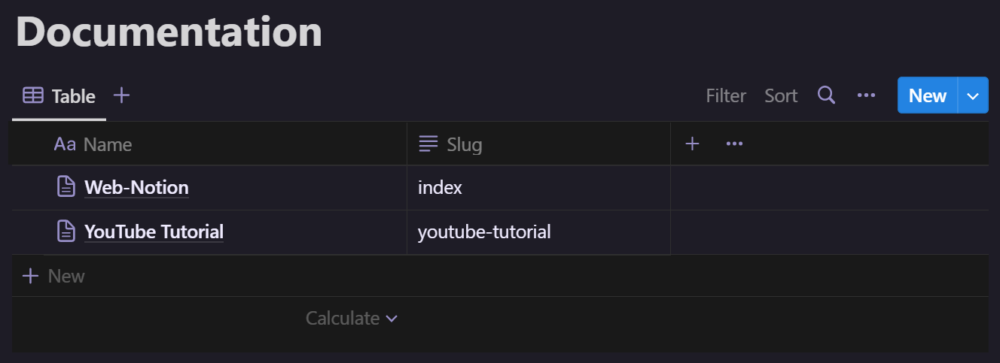

# Web-Notion

[](https://github.com/Rickaym/web-notion/actions/workflows/static.yml)

Web-notion is an express-handlebar based web server that uses Notion as a content database. It is built to be hosted statically with sparsely edited content, so it must be rebuilt every time there are major changes to the database. However, it can also be hosted on a webserver to render updates dynamically.

# Table of Contents

- [Get Started](#get-started)
  - [Pre-requisites](#pre-requisites)
  - [Setup Database](#setup-database)
  - [Setup Notion](#setup-notion)
- [Customizing the Website](#customizing-the-website)
- [Examples](#examples)
- [Hosting](#hosting)
  - [Static Hosting](#static-hosting)
  - [Webserver Hosting](#webserver-hosting)
- [Updating Web-Notion](#updating-web-notion)

## Get Started

### Pre-requisites
1. Clone the repository

```bash
git clone --recurse-submodules https://github.com/Rickaym/web-notion.git
```

2. Install dependencies
```bash
npm install
```

### Setup Database

3. Create a new database in Notion (it doesn't need to be public)

The database must have the following two columns:
- `Name` - This is where the page itself is stored
- `Slug` (optional) - This is where the slug of the page is stored, if a value is not present in this column, a slug will be made automatically through the name of the page

E.g.



The content for each page should be stored inside the nested page of the `Name` column.

### Setup Notion

4.  Create a Notion integration by following [Step 1: Create an integration](https://developers.notion.com/docs/create-a-notion-integration#step-1-create-an-integration) from the official docs, this is required to access the database
4. Create a file named `.env` in the project root and copy the integration secret into it in the format of `NOTION_API_KEY="{secret}"`
5. Then follow [Step 2: Share a database with your integration](https://developers.notion.com/docs/create-a-notion-integration#step-2-share-a-database-with-your-integration) and setup the database to be used with the integration
6. Copy the ID of the database [like this](https://developers.notion.com/docs/create-a-notion-integration#step-3-save-the-database-id) and set it to `NOTION_DATABASE_ID` in `.env`

So the `.env` file should look something like this in total:

```env
NOTION_API_KEY="secret_..."
NOTION_DATABASE_ID="...-...-..-.."
```

7. Run the project!
```bash
npm start
```

## Customizing the Website

When web-notion serves the page, it renders the content of the Notion document into a handlebar layout. This process enables us to display the content of the page in a completely customized way, whilst still takeing advantage of the markdown format that notion provides.

You can achieve this customization by editing the layouts in the [`views`](./views) folder.

There are two main layouts that are used to render the pages:

1. `views/index.hbs` - This layout is used to render the root page of the website
2. `views/page.hbs` - This layout is used for everything else; non-index and nested pages

When editing these layouts, you are provided with the following variables through handlebars:

```json
{
        "id": "e78f702d-bed1-413e-9623-a93aa9b7d05d",
        "createdTime": "2023-07-30T03:26:00.000Z",
        "lastEditedTime": "2023-08-04T15:32:00.000Z",
        "slug": "index",
        "title": "Web-Notion",
        "pageUrl": "https://www.notion.so/Web-Notion-e78f702dbed1413e9623a93aa9b7d05d",
        "icon": null,
        "cover": null,
        "content": {
            "markdown": "...",
            "text": "...",
            "html": "..."
        }
    }
```

To use these variables, you can use the following syntax in your layout:

```handlebars
{{variable}}
```

While both of the layouts `page.hbs` and `index.hbs` have these variables (`index.hbs` with the context of the index page and `page.hbs` with the page being rendered) `index.hbs` gets a special variable called `pages`. It is a list object that contains all the pages (index page excluded).

## Examples

This repository contains an example of a customized website that runs through web-notion. Take a look at [`views/index.hbs`](./views/index.hbs) and [`views/page.hbs`](./views/page.hbs) for how the customization is best done.

## Hosting

### Static Hosting

Hosting web-notion statically is possible. It is achieved through [a static site generation workflow](https://github.com/Rickaym/web-notion/blob/master/.github/workflows/static.yml) that does the job of fetching content and rendering it all in build time. The drawback however is that changes to the notion document will not be rendered unless the site is rebuilt.

### Webserver Hosting

Follow these steps to host web-notion on a webserver (this requires the steps in Getting Started to be done):

1. Install dependencies

```bash
npm install
```
2. Run the project

```bash
npm start
```


## Updating Web-Notion

To update web-notion-core submodule (the js files that builds the website), run the following command:

```bash
cd ./core && git pull origin master && cd ..
```